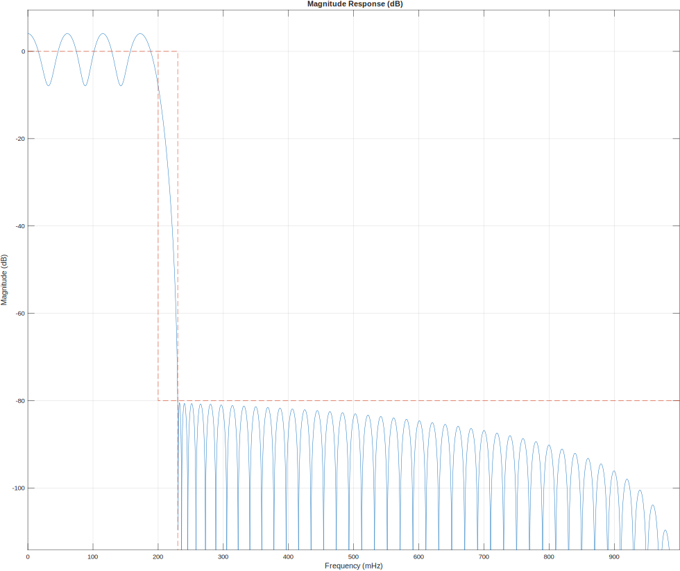

## Documentation: 100-Tap Low-Pass FIR Filter Design

This document details the MATLAB implementation of a high-precision, low-pass Finite Impulse Response (FIR) filter designed for applications requiring a sharp transition and high stop-band attenuation.

---

### Core Specifications
The filter was designed based on the following frequency and magnitude constraints:

| Parameter | Value | Justification |
| :--- | :--- | :--- |
| **Sampling Frequency ($f_s$)** | $2$ (Normalized) | Sets the Nyquist frequency to $1$ ($\pi$ rad/sample) for generalized digital design. |
| **Passband Edge ($f_{pass}$)** | $0.2\pi$ rad/sample | The frequency up to which the signal is passed with minimal distortion. |
| **Stopband Edge ($f_{stop}$)** | $0.23\pi$ rad/sample | The frequency at which the 80dB attenuation must be fully achieved. |
| **Transition Width** | $0.03\pi$ rad/sample | A very narrow transition requiring a high-order filter. |
| **Stopband Attenuation** | $80$ dB | Ensures that unwanted high-frequency noise is reduced by a factor of $10,000$. |
| **Filter Order** | $99$ | Choosing an order of $99$ results in exactly **100 Taps**. |

---

### Implementation Details

The design utilizes the `designfilt` function, which employs the **Equiripple (Parks-McClellan)** algorithm by default for these specifications.

#### 1. Filter Design Object
The `designfilt` command creates a digital filter object (`lpFilt`). Using an Equiripple design is superior to a standard Window method (like Hamming) because it optimally distributes the "ripples" across the passband and stopband, allowing us to hit the strict **80 dB** requirement with the minimum possible error.

#### 2. Line Continuation (`...`)
The code uses the `...` operator to break the `designfilt` parameters into multiple lines. This choice is made strictly for **readability and maintainability**, ensuring each design constraint is clearly visible.

#### 3. Coefficient Extraction and Verification
The coefficients (taps) are extracted from the object using `lpFilt.Coefficients`. The code then prints these values to the Command Window to verify the numerical precision and confirm that the vector length is exactly 100.

#### 4. Data Export
The coefficients are exported to `filter_taps.csv` using `writematrix`. This facilitates the porting of these weights into external hardware environments, such as a C++ header file or an FPGA memory initialization file.

---

### Visual Analysis
The filter performance is visualized using `fvtool`. You can refer to the exported figure **"FilterAnalysis.svg"** for the following characteristics:

* **Magnitude Response:** Confirms the 80 dB drop starting at $0.23\pi$.
* **Linear Phase:** Shows a constant group delay, ensuring no phase distortion is introduced into the filtered signal.
* **Transition Sharpness:** Illustrates how the 100 taps successfully manage the tight $0.03\pi$ transition region.

> **Note:** If the transition region needs to be even narrower in future iterations, the `FilterOrder` must be increased beyond 99, which will increase the total number of taps and computational latency.
