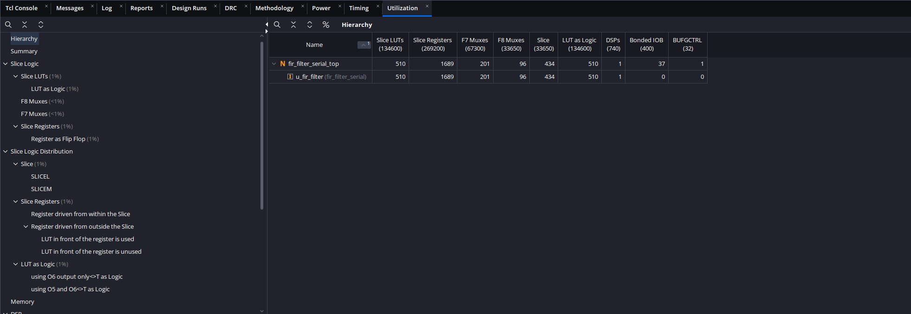
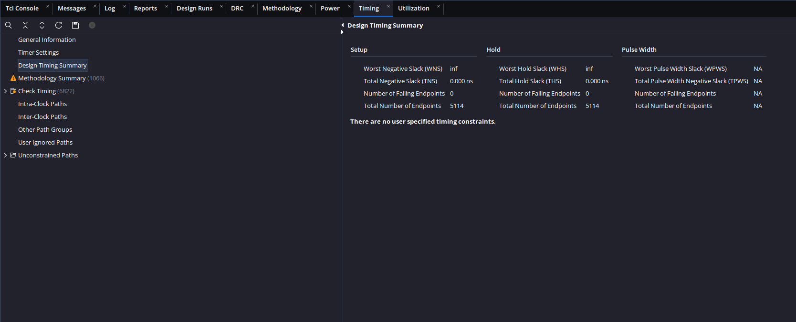
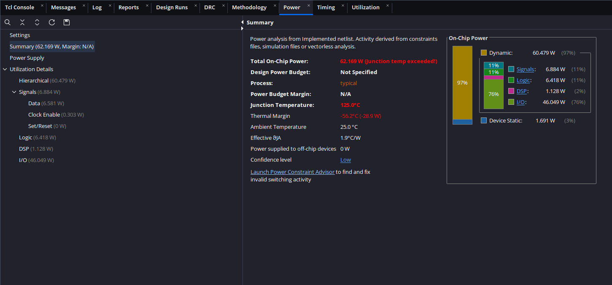
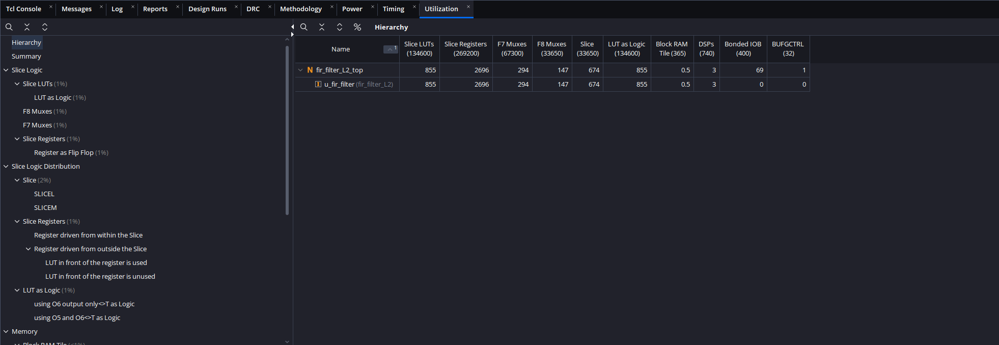
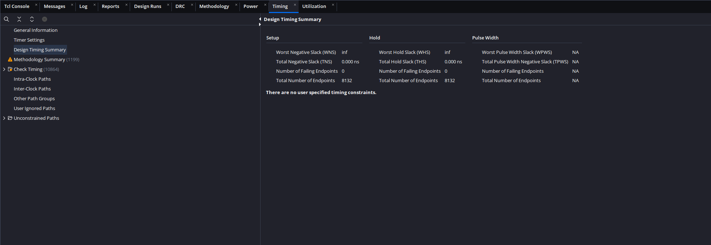
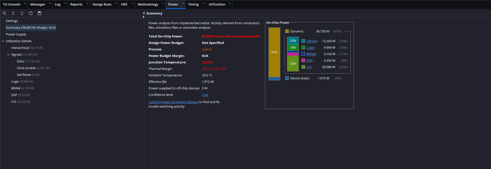
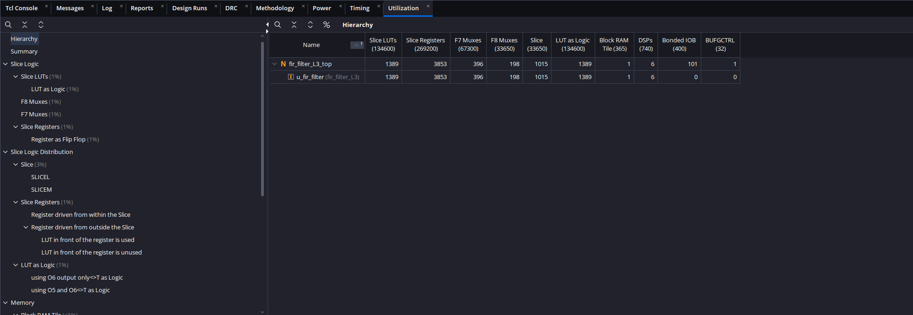
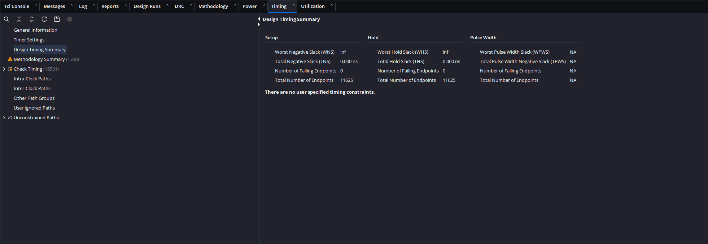
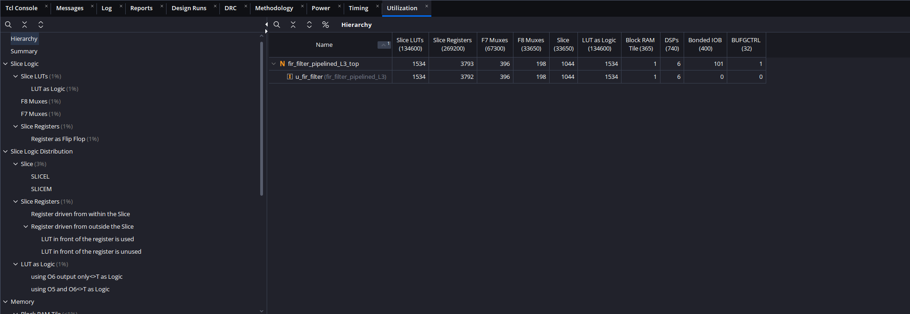

# FIR Filter Architecture Overview

## 1. Introduction

This document describes five progressively optimized architectures for a **100-tap FIR filter** targeting FPGA implementation. All five compute the same mathematical function:

$$
y[n] = \sum_{k=0}^{N-1} h[k] \cdot x[n-k], \quad N = 100
$$

They differ in **how the computation is scheduled across time and hardware**, trading off between resource usage and throughput.

| Architecture | Multipliers | Cycles per Output | Relative Throughput |
|---|---|---|---|
| Serial | 1 | 102 | 1x |
| L=2 Parallel (reduced complexity) | 3 | 26 | ~3.9x |
| L=3 Parallel (reduced complexity) | 6 | 12 | ~8.5x |
| Pipelined + L=3 Parallel | 6 | ~12.3 (at higher f_clk) | Highest at f_clk |
| Systolic Array | 100 | 1 | Highest throughput |

Each design is organized in its own directory under `rtl/` and includes a **top-level wrapper** (`*_top.sv`) that instantiates all sub-modules (filter core, coefficient ROM, etc.) with internal wiring, exposing only the user-facing I/O. All designs share a common **coefficient ROM** (`coeff_rom.sv`) that stores 100 quantized coefficients in Q1.15 signed fixed-point format, initialized directly in the SystemVerilog source via an `initial` block. Each design directory contains its own copy of the ROM.

---

## 2. MATLAB Filter Design and Quantization (`Matlab Implementation/`)

### 2.1 Filter Specification

The filter is designed entirely in MATLAB using the `designfilt` function with the **equiripple** (Parks-McClellan) method. The target specifications are:

| Parameter | Value |
|---|---|
| Filter type | Lowpass FIR |
| Filter order | 99 (100 taps) |
| Passband edge | 0.2 (normalized, i.e. 0.2 pi rad/sample) |
| Stopband edge | 0.23 (normalized, i.e. 0.23 pi rad/sample) |
| Stopband attenuation | 80 dB |
| Sample rate | 2 (normalized Nyquist = 1) |

The equiripple method distributes the approximation error uniformly across both the passband and stopband, producing a minimax-optimal design for the given order and band edges.

### 2.2 Ideal Filter Response

The figure below shows the magnitude and phase response of the 100-tap ideal (floating-point) filter as produced by MATLAB's `fvtool`:


The design achieves the target 80 dB stopband attenuation with a sharp transition band between 0.2 pi and 0.23 pi rad/sample. The filter coefficients are symmetric (linear phase), resulting in a purely linear phase response across the passband.

### 2.3 Coefficient Quantization

For hardware implementation, the floating-point coefficients must be quantized to a fixed-point format. The project uses **Q1.15 signed fixed-point**:

- **1 sign bit + 15 fractional bits** (16 bits total)
- Scale factor: 2^15 = 32768
- Representable range: [-1.0, +0.999969...]
- Resolution (LSB): ~3.05 x 10^-5

The quantization process in the MATLAB script:

1. **Scale**: multiply each floating-point coefficient by 2^15
2. **Round**: round to the nearest integer
3. **Saturate**: clamp to the signed 16-bit range [-32768, +32767]
4. **Convert back**: divide by 2^15 to obtain the quantized floating-point equivalent

These integer values are exactly what is embedded in the hardware coefficient ROM (`coeff_rom.sv`).

### 2.4 Quantization Impact

The figure below overlays the ideal and quantized frequency responses, with a separate subplot showing the quantization error magnitude across frequency:


The top subplot shows that the quantized (Q1.15) response closely tracks the ideal response — the two curves are visually indistinguishable in the passband and transition band. The bottom subplot isolates the quantization error, confirming that the 16-bit representation introduces negligible degradation relative to the 80 dB stopband specification.

### 2.5 Output Files

The script exports two CSV files:

- `filter_taps.csv` — ideal floating-point coefficients (64-bit precision)
- `filter_taps_quantized.csv` — quantized Q1.15 coefficients (as floating-point values)

The quantized CSV can be cross-checked against the integer values in the hardware ROM to verify consistency between the MATLAB model and the RTL implementation.

---

## 3. Serial Architecture (`rtl/FIR_Serial/`)

### 3.1 Concept

The serial architecture is the simplest possible implementation. It uses **one multiplier and one accumulator** (a single MAC unit) and processes all 100 taps sequentially, one per clock cycle.

### 3.2 Block Diagram

```
                    ┌─────────────┐
   data_in ───────> │ Shift Reg   │ (100 entries)
                    │ (Delay Line)│
                    └──────┬──────┘
                           │ delay_line[tap_cnt]
                           v
                    ┌──────────────┐      ┌───────────┐
                    │  Pipeline    │      │ Coeff ROM │
                    │  Register    │      │ (100 x 16)│
                    └──────┬───────┘      └─────┬─────┘
                           │                    │ h[tap_cnt]
                           v                    v
                        ┌──────────────────────────┐
                        │       Multiplier         │
                        └────────────┬─────────────┘
                                     │
                                     v
                        ┌──────────────────────────┐
                        │  Accumulator (39 bits)   │
                        └────────────┬─────────────┘
                                     │
                                     v
                              data_out (16 bits)
```

### 3.3 Operation

A finite state machine with three states controls the process:

1. **S_IDLE**: Waits for `data_valid`. On assertion, shifts the new sample into the delay line, clears the accumulator, and starts the MAC counter.

2. **S_MAC**: The counter `tap_cnt` increments from 0 to `NUM_TAPS`. On each cycle, the ROM is addressed with `tap_cnt`, and the corresponding delay line entry is registered. Due to the ROM's 1-cycle read latency, valid multiply-accumulate operations begin at `tap_cnt = 1`. This means:
   - At `tap_cnt = 0`: address 0 is sent to ROM, `delay_line[0]` is registered.
   - At `tap_cnt = 1`: `h[0]` arrives from ROM, multiplied with the registered `delay_line[0]`, accumulated.
   - At `tap_cnt = N`: the last product `h[N-1] * delay_line[N-1]` is accumulated.

3. **S_DONE**: The accumulator is truncated to `DATA_WIDTH` bits by extracting bits `[30:15]` (equivalent to right-shifting by `COEFF_WIDTH - 1 = 15`), outputting the result in the same Q1.15 format as the input.

### 3.4 Timing

- **Latency**: `NUM_TAPS + 2 = 102` clock cycles per output sample.
- **Throughput**: 1 output every 102 cycles.
- **Resources**: 1 multiplier, 1 accumulator, 100-entry delay line, 1 ROM.

### 3.5 FPGA Implementation Reports

The following reports are from Xilinx Vivado targeting the AMD Artix 7 FPGA (AC701 Evaluation Kit, xc7a200tfbg676-2).

**Utilization:**



**Timing:**



**Power:**



---

## 4. Reduced-Complexity Parallel Processing

### 4.1 What is Parallel Processing in FIR Filters?

In a standard (serial) FIR filter, one input sample produces one output sample. In an **L-parallel** FIR filter, **L input samples are accepted simultaneously** and **L output samples are produced simultaneously** in each computation block.

The input and output sequences are split into L interleaved streams using **polyphase decomposition**. For L=2:

$$
H(z) = H_0(z^2) + z^{-1} H_1(z^2)
$$

where $H_0$ contains the even-indexed coefficients {h[0], h[2], h[4], ...} and $H_1$ contains the odd-indexed coefficients {h[1], h[3], h[5], ...}.

Similarly, the input is split: $x_0[k] = x[2k]$ and $x_1[k] = x[2k+1]$.

### 4.2 Naive vs Reduced Complexity

A **naive** L-parallel implementation directly computes all L^2 cross-terms between the L input streams and L coefficient subsets, requiring L^2 subfilter convolutions.

| L | Naive subfilters | Reduced-complexity subfilters | Saving |
|---|---|---|---|
| 2 | 4 | 3 | 25% |
| 3 | 9 | 6 | 33% |

**Reduced complexity** exploits algebraic identities (similar to Karatsuba multiplication) to recover the cross-products from fewer subfilter computations. The key insight is:

> If we know $A \cdot B$, $C \cdot D$, and $(A+C) \cdot (B+D)$, we can compute the cross-terms $A \cdot D + C \cdot B$ as $(A+C)(B+D) - AB - CD$ without any additional multiplications.

This trades **pre-additions and post-additions** (cheap in hardware) for **subfilter multiplications** (expensive in hardware).

---

## 5. L=2 Parallel Architecture (`rtl/FIR_L2_reduced/`)

### 5.1 Algorithm

Three subfilter convolutions replace the naive four:

| Subfilter | Coefficients | Data | Taps |
|---|---|---|---|
| F0 | H0 = {h[0], h[2], ...} | x0 = x[2k] | 50 |
| F1 | H1 = {h[1], h[3], ...} | x1 = x[2k+1] | 50 |
| F2 | H0 + H1 | x0 + x1 | 50 |

**Pre-addition** (before the delay lines): $x_{sum} = x_0 + x_1$ (DATA_WIDTH+1 bits)

**Coefficient sum** (combinational from two ROM outputs): $h_{sum}[k] = h[2k] + h[2k+1]$ (COEFF_WIDTH+1 bits)

**Post-combination** (after all subfilters complete):

$$
y_0[k] = F_0[k] + F_1[k-1]
$$

$$
y_1[k] = F_2[k] - F_0[k] - F_1[k]
$$

The $F_1[k-1]$ term is a **block delay** ($z^{-1}$ in the polyphase domain), stored in a register `f1_prev` across computation blocks.

### 5.2 Block Diagram

```
  x0 ───────────────────┬──────> Delay Line F0 ──> MAC(H0)  ──> accum_f0
                        │                                          │
  x1 ────────────┬──────┼──────> Delay Line F1 ──> MAC(H1)  ──> accum_f1
                 │      │                                          │
                 │      v                                          │
                 └───> (+) ────> Delay Line F2 ──> MAC(H0+H1) ──> accum_f2
                                                                   │
                                                            Post-Combination
                                                                   │
                                                            y0, y1 outputs
```

### 5.3 ROM Strategy

Two instances of `coeff_rom` (both containing all 100 coefficients) are addressed with different stride patterns:
- **ROM_A**: addresses 0, 2, 4, ..., 98 (even indices, for H0)
- **ROM_B**: addresses 1, 3, 5, ..., 99 (odd indices, for H1)

The sum coefficient $H_0 + H_1$ is computed **combinationally** from the ROM outputs each cycle, requiring no additional storage.

### 5.4 Timing

- **Subfilter length**: 50 taps (half of the original 100)
- **MAC cycles**: 50 + 1 = 51 (same pipeline as serial, but over 50 taps)
- **Total latency**: 50 + 2 = **52 cycles for 2 outputs = 26 cycles per output**
- **Speedup over serial**: 102/26 = ~3.9x

### 5.5 FPGA Implementation Reports

**Utilization:**



**Timing:**



**Power:**



---

## 6. L=3 Parallel Architecture (`rtl/FIR_L3_reduced/`)

### 6.1 Algorithm

The 3-way polyphase decomposition splits the filter into three subsets:

$$
H(z) = H_0(z^3) + z^{-1} H_1(z^3) + z^{-2} H_2(z^3)
$$

Six subfilter convolutions replace the naive nine:

| Subfilter | Coefficients | Data | Purpose |
|---|---|---|---|
| P0 | H0 | x0 | Base |
| P1 | H1 | x1 | Base |
| P2 | H2 | x2 | Base |
| P3 | H0 + H1 | x0 + x1 | Recovers H0*x1 + H1*x0 |
| P4 | H1 + H2 | x1 + x2 | Recovers H1*x2 + H2*x1 |
| P5 | H0 + H2 | x0 + x2 | Recovers H0*x2 + H2*x0 |

**Cross-product recovery**:

$$
H_0 x_1 + H_1 x_0 = P_3 - P_0 - P_1
$$

$$
H_1 x_2 + H_2 x_1 = P_4 - P_1 - P_2
$$

$$
H_0 x_2 + H_2 x_0 = P_5 - P_0 - P_2
$$

**Post-combination**:

$$
y_0[k] = P_0[k] + \underbrace{(P_4[k{-}1] - P_1[k{-}1] - P_2[k{-}1])}_{\text{prev\_cross (stored from previous block)}}
$$

$$
y_1[k] = (P_3[k] - P_0[k] - P_1[k]) + \underbrace{P_2[k{-}1]}_{\text{prev\_p2}}
$$

$$
y_2[k] = (P_5[k] - P_0[k] - P_2[k]) + P_1[k]
$$

### 6.2 ROM Strategy

Three ROM instances, each addressed at stride 3:
- **ROM_A**: 3k (for H0)
- **ROM_B**: 3k+1 (for H1)
- **ROM_C**: 3k+2 (for H2)

**Coefficient validity gating**: Since 100 is not divisible by 3, the subfilter lengths differ (H0: 34 taps, H1 and H2: 33 taps). At the last iteration (k=33), addresses 100 and 101 exceed the ROM range. A registered validity flag forces the coefficient to zero when the address is out of bounds.

### 6.3 z⁻¹ Register Optimization

Instead of storing three separate previous-block values (P1, P2, P4), the design pre-computes and stores only two registers:
- `prev_cross = P4 - P1 - P2` (for y0)
- `prev_p2 = P2` (for y1)

### 6.4 Timing

- **Subfilter length**: ceil(100/3) = 34 taps
- **MAC cycles**: 34 + 1 = 35
- **Total latency**: 34 + 2 = **36 cycles for 3 outputs = 12 cycles per output**
- **Speedup over serial**: 102/12 = ~8.5x

### 6.5 FPGA Implementation Reports

**Utilization:**



**Timing:**



**Power:**


---

## 7. Combined Pipelining and Parallel Processing (`rtl/FIR_L3_combined/`)

### 7.1 What is Pipelining in this Context?

**Pipelining** and **parallel processing** are complementary optimization techniques:

| Technique | What it does | Effect |
|---|---|---|
| **Parallel processing** | Processes L samples per block using L-way decomposition | Increases throughput by factor ~L |
| **Pipelining** | Inserts registers to break long combinational paths into shorter stages | Increases achievable clock frequency |

In the non-pipelined L=3 design, each subfilter MAC has a **2-stage pipeline**:

```
Stage 1: ROM read + delay register        (1 cycle)
Stage 2: Multiply + Accumulate             (combinational, same cycle)
```

The critical path of Stage 2 is `T_multiply + T_accumulate`, which limits the maximum clock frequency. On a typical FPGA, a 16x16 multiplication followed by a 41-bit addition can be the timing bottleneck.

**Combined pipelining** adds a register between the multiplier and accumulator, creating a **3-stage pipeline**:

```
Stage 1: ROM read + delay register        (1 cycle)
Stage 2: Multiply, REGISTER product        (1 cycle)  <-- NEW pipeline cut
Stage 3: Accumulate from registered product (1 cycle)
```

This reduces the critical path from `T_multiply + T_accumulate` to `max(T_multiply, T_accumulate)`, enabling a higher clock frequency.

### 7.2 Why Combine Both?

Neither technique alone achieves maximum throughput:

- **Parallel processing alone** (L=3): Produces 3 outputs every 36 cycles, but the clock is limited by the multiply+accumulate critical path.
- **Pipelining alone**: Allows a faster clock, but still processes only 1 output per ~102 cycles.
- **Combined**: Produces 3 outputs every 37 cycles, but at a significantly higher clock frequency. The net throughput (outputs per second) is the highest of all four designs.

### 7.3 Architectural Difference

The **only** structural change from the non-pipelined L=3 to the pipelined version is the addition of 6 pipeline registers (`mult_r0..mult_r5`):

```
 NON-PIPELINED (FIR_L3_reduced/fir_filter_L3):
    coeff ───┐
             ├──> Multiplier ──────────────> Accumulator
  delay_r ───┘        (combinational path: T_mult + T_accum)

 PIPELINED (FIR_L3_combined/fir_filter_pipelined_L3):
    coeff ───┐
             ├──> Multiplier ──> [REG] ──> Accumulator
  delay_r ───┘        T_mult        T_accum
                  (critical path = max of the two)
```

### 7.4 Counter Adjustment

The extra pipeline stage shifts the accumulation phase by one cycle:

| Phase | Non-pipelined (tap_cnt) | Pipelined (tap_cnt) |
|---|---|---|
| Address + delay reg | 0 .. ST-1 | 0 .. ST-1 |
| Multiply register | (combinational) | 1 .. ST |
| Accumulate | 1 .. ST | **2 .. ST+1** |
| Total MAC cycles | ST + 1 = 35 | **ST + 2 = 36** |

Where ST = SUBFILTER_TAPS = 34.

### 7.5 Timing

- **MAC cycles**: 34 + 2 = 36 (one more than non-pipelined)
- **Total latency**: 34 + 3 = **37 cycles for 3 outputs**
- **Cycles per output**: ~12.3 (marginally more than non-pipelined)
- **Clock frequency**: Significantly higher due to shorter critical path
- **Net throughput**: Highest of all four architectures

### 7.6 FPGA Implementation Reports

**Utilization:**



**Timing:**


**Power:**


---

## 8. Systolic Array Architecture (`rtl/Systolic Filter/`)

### 8.1 Why a Systolic Array?

The previous architectures (serial, L=2/L=3 parallel) all share a fundamental limitation: they are **block-based**. Each block of L input samples requires tens of MAC cycles before the next block can be accepted. The filter is idle between blocks if upstream data arrives faster than it can be processed.

A **systolic array** takes a fundamentally different approach. Instead of time-multiplexing a few multipliers across many taps, it dedicates **one multiplier per tap** and arranges them in a pipelined chain. The result is the highest possible throughput: **one output per clock cycle** in steady state.

The design reasoning behind choosing a systolic array:

1. **Throughput ceiling**: The serial and parallel designs are bounded by `cycles_per_output >= ceil(NUM_TAPS / (L * num_multipliers))`. The only way to reach 1 cycle/output is to have NUM_TAPS multipliers working simultaneously.

2. **Regular, local interconnect**: Unlike a parallel multiplier bank with a global adder tree, a systolic array uses only **nearest-neighbor connections**. Each PE talks only to its immediate left and right neighbors. This is ideal for FPGA routing and ASIC physical design because there are no long wires or fan-out bottlenecks.

3. **Short critical path**: Each PE performs exactly one multiply-add and one register stage. The critical path is `T_mult + T_add` within a single PE, regardless of the total number of taps. Adding more taps increases latency (pipeline depth) but does not affect clock frequency.

4. **Natural separation of concerns**: The coefficient ROM, the systolic array, and the controller are cleanly decoupled. The ROM is read once at startup; the array runs autonomously during streaming. This modularity makes the design easy to verify and reuse.

### 8.2 Why the Transposed Direct Form?

There are several systolic FIR topologies. The **transposed direct form** was chosen because it avoids a fundamental timing problem that affects other topologies:

**The problem with data-flowing + partial-sum-flowing designs:**

If both data and partial sums flow in the same direction through registered PEs, they arrive at each PE with the **same delay**. PE[k] receives data sample `x[t-k]` and partial sum `h[0]*x[t-k] + ... + h[k-1]*x[t-k]` — all terms reference the same time index `t-k`. The result is `(h[0] + h[1] + ... + h[k]) * x[t-k]`, which is a **coefficient sum**, not a convolution. This is fundamentally incorrect.

Fixing this requires either:
- Making the partial sum path combinational (semi-systolic), creating a critical path that spans all N PEs
- Pre-skewing the input data with extra delay stages, adding complexity and latency

**Why the transposed form works:**

In the transposed form, input `x[n]` is **broadcast** to all PEs simultaneously (no data delay chain). Each PE multiplies `x[n]` with its stored coefficient and adds the result to a **registered partial sum from the right neighbor**:

```
cascade_out[k] <= cascade_in[k] + h[k] * x[n]
```

Because the cascade registers introduce delay between PEs, the partial sum arriving at PE[k] from PE[k+1] was computed one cycle earlier — when the input was `x[n-1]`. This natural delay means PE[k]'s output accumulates products from different time steps:

```
PE[0] output at time n = h[0]*x[n] + h[1]*x[n-1] + h[2]*x[n-2] + ... + h[N-1]*x[n-N+1]
```

This is exactly the FIR convolution, achieved with purely local connections and no data skewing.

**Trade-off**: The input `x[n]` is broadcast as a global signal (fan-out to all PEs), which is a long wire on FPGA. However, FPGA clock distribution networks handle high-fanout signals well, and synthesis tools automatically insert buffer trees. The partial sum chain — the timing-critical path — remains purely local.

### 8.3 Module Hierarchy

The design is split into three modules for clean separation of concerns:

```
fir_filter_systolic_top.sv      Top-level wrapper (user-facing I/O)
  |
  +-- fir_filter_systolic.sv    Controller: reads ROM, loads PEs, streams data
        |
        +-- coeff_rom.sv        Existing ROM with 100 embedded coefficients
        |
        +-- systolic_array.sv   Chain of NUM_PES processing elements
              |
              +-- systolic_pe.sv [0]      PE[0]: outputs y[n]
              +-- systolic_pe.sv [1]
              +-- ...
              +-- systolic_pe.sv [99]     PE[99]: cascade_in = 0
```

### 8.4 Processing Element Design (`systolic_pe.sv`)

Each PE contains:

```
                 data_in (broadcast x[n])
                    |
                    v
              +-----------+
 coeff_shift  | coeff_r   |  <-- stored coefficient (loaded via shift chain)
   in/out     |  (16-bit) |
              +-----+-----+
                    |
                    v
             [ Multiplier ]   <-- combinational: coeff_r * data_in (32-bit product)
                    |
                    v
 cascade_in ---> [ Adder ] ---> [ Register ] ---> cascade_out
 (from right)                                     (to left)
```

**Coefficient shift chain**: When `coeff_load_en` is asserted, each PE shifts its current coefficient to the right neighbor and loads a new value from its left neighbor. This forms a daisy chain:

```
ROM data --> PE[0] --> PE[1] --> ... --> PE[N-1]
```

By pushing `h[N-1]` first and `h[0]` last, after N load cycles PE[k] holds `h[k]`.

### 8.5 Controller FSM (`fir_filter_systolic.sv`)

Only two states are needed:

**S_LOAD_COEFFS** (startup, N+1 cycles):
```
Cycle 0:   ROM addr = N-1                         (no data yet)
Cycle 1:   ROM addr = N-2,  shift h[N-1] into PEs
Cycle 2:   ROM addr = N-3,  shift h[N-2] into PEs
  ...
Cycle N:   (done),          shift h[0] into PEs   --> S_RUN
```

**S_RUN** (continuous streaming):
- When `data_valid` is high: feed `data_in` to the systolic array
- When `data_valid` is low: feed 0 (treated as a zero-valued sample)
- A **validity shift register** (NUM_PES bits) tracks pipeline latency:
  each cycle, `data_valid` is shifted in; `data_out_valid` is the bit
  that emerges after NUM_PES stages

No flush state is needed because all cascade registers are cleared to zero on reset. The first NUM_PES-1 outputs include contributions from these initial zeros, which the validity shift register correctly suppresses.

### 8.6 Timing and Performance

| Parameter | Value |
|---|---|
| Coefficient load time | NUM_TAPS + 1 = 101 cycles (one-time at startup) |
| Pipeline latency | NUM_PES = 100 cycles (first valid output after 100 input samples) |
| **Steady-state throughput** | **1 output per clock cycle** |
| Critical path | T_mult + T_add (within a single PE, independent of NUM_TAPS) |
| Multipliers (DSP blocks) | 100 |
| Delay line registers | 0 (delay is implicit in the cascade chain) |

### 8.7 Comparison with Previous Architectures

The systolic array represents the opposite end of the resource/throughput spectrum from the serial design:

| Property | Serial | Systolic |
|---|---|---|
| Multipliers | 1 | 100 |
| Throughput | 1 output / 102 cycles | **1 output / cycle** |
| Explicit delay line | 100 registers | None (cascade chain is the delay) |
| Coefficient storage | ROM (read each cycle) | PE registers (loaded once) |
| Control complexity | FSM with counter | Simple 2-state FSM |
| Data flow | Time-multiplexed | Spatially distributed |

The serial filter reuses one multiplier across all taps in time. The systolic array distributes the taps across space (one per PE) and processes them simultaneously. The L=2/L=3 parallel designs occupy the middle ground.

### 8.8 FPGA Implementation Reports

**Utilization:**


**Timing:**


**Power:**


---

## 9. Comparison Summary

### 9.1 Resource and Performance Table

| | Serial | L=2 | L=3 | Pipelined L=3 | Systolic |
|---|---|---|---|---|---|
| **Multipliers** | 1 | 3 | 6 | 6 | **100** |
| **ROM instances** | 1 | 2 | 3 | 3 | 1 |
| **Delay line entries** | 100 | 3 x 50 | 6 x 34 | 6 x 34 | 0 |
| **Accumulators** | 1 | 3 | 6 | 6 | 100 (cascade) |
| **Pipeline registers** | 0 | 0 | 0 | 6 (mult_r) | 0 |
| **z⁻¹ block regs** | 0 | 1 | 2 | 2 | 0 |
| **Cycles / output** | 102 | 26 | 12 | ~12.3 | **1** |
| **Critical path** | T_m + T_a | T_m + T_a | T_m + T_a | max(T_m, T_a) | **T_m + T_a (1 PE)** |
| **Startup latency** | 0 | 0 | 0 | 0 | N+1 (load) + N (fill) |

### 9.2 Design Trade-offs

1. **Serial**: Minimum hardware, maximum latency. Ideal for understanding the basic FIR operation and for applications where throughput is not critical.

2. **L=2 Parallel**: 3x the multipliers for ~4x throughput improvement. The 25% multiplier savings over naive (4 multipliers) comes from the pre-addition / post-subtraction identity.

3. **L=3 Parallel**: 6x the multipliers for ~8.5x throughput. The 33% savings over naive (9 multipliers) follows the same algebraic principle extended to 3 streams.

4. **Pipelined + L=3**: Same multiplier count as L=3, but adds pipeline registers to break the critical path. The 1-cycle latency increase is negligible; the real benefit is the higher achievable clock frequency, which translates to the highest throughput in samples per second.

5. **Systolic array**: Maximum hardware (100 multipliers) for maximum throughput (1 output/cycle). The regular, local interconnect structure is highly efficient on FPGAs and ASICs. The one-time startup cost (loading coefficients + pipeline fill) is amortized over continuous streaming operation. Best suited for high-throughput real-time applications.

### 9.3 Common Design Elements

All five architectures share:
- **Q1.15 signed fixed-point** data and coefficient format
- **Synchronous ROM** with 1-cycle read latency (infers BRAM on FPGA)
- **Output scaling**: Extract bits `[DATA_WIDTH + COEFF_WIDTH - 2 : COEFF_WIDTH - 1]` from the accumulator, equivalent to right-shifting by `COEFF_WIDTH - 1 = 15` bits
- **Parameterized design**: `NUM_TAPS`, `DATA_WIDTH`, `COEFF_WIDTH` are all configurable

---

## 10. File Structure

Each filter design is organized in its own subdirectory under `rtl/`, containing the filter core, a local copy of the coefficient ROM, and a top-level wrapper that wires everything together. Testbenches instantiate the `_top` modules.

```
rtl/
  FIR_Serial/
    coeff_rom.sv                  Coefficient ROM (100 x Q1.15)
    fir_filter_serial.sv          Serial filter core (external ROM interface)
    fir_filter_serial_top.sv      Top: connects serial filter + ROM

  FIR_L2_reduced/
    coeff_rom.sv                  Coefficient ROM
    fir_filter_L2.sv              L=2 reduced-complexity filter (ROM internal)
    fir_filter_L2_top.sv          Top: wraps L=2 filter

  FIR_L3_reduced/
    coeff_rom.sv                  Coefficient ROM
    fir_filter_L3.sv              L=3 reduced-complexity filter (ROM internal)
    fir_filter_L3_top.sv          Top: wraps L=3 filter

  FIR_L3_combined/
    coeff_rom.sv                  Coefficient ROM
    fir_filter_pipelined_L3.sv    Pipelined L=3 filter (ROM internal)
    fir_filter_pipelined_L3_top.sv Top: wraps pipelined L=3 filter

  Systolic Filter/
    coeff_rom.sv                  Coefficient ROM
    fir_filter_systolic.sv        Systolic controller (ROM + array internal)
    fir_filter_systolic_top.sv    Top: wraps systolic filter
    systolic_array.sv             Chain of NUM_PES processing elements
    systolic_pe.sv                Single processing element

tb/
  fir_filter_serial_tb.sv         Testbench for serial filter (uses _top)
  fir_filter_L2_tb.sv             Testbench for L=2 filter (uses _top)
  fir_filter_L3_tb.sv             Testbench for L=3 filter (uses _top)
  fir_filter_pipelined_L3_tb.sv   Testbench for pipelined L=3 (uses _top, with L=3 reference)
  fir_filter_systolic_tb.sv       Testbench for systolic filter (uses _top)

Reports/
  FIR_Serial/
    Utilization_Report_FIR_serial.png
    Timing_Report_FIR_serial.png
    Power_Report_FIR_serial.png

  FIR_L2_reduced/
    Utilization_Report_FIR_L2.png
    Timing_Report_FIR_L2.png
    Power_Report_FIR_L2.png

  FIR_L3_reduced/
    Utilization_Report_FIR_L3.png
    Timing_Report_FIR_L3.png
    Power_Report_FIR_L3.png

  FIR_L3_combined/
    Utilization_Report_FIR_L3_Pipelined.png
    Timing_Report_FIR_L3_Pipelined.png
    Power_Report_FIR_L3_Pipelined.png

  Systolic Filter/
    Utilization_Report_FIR_systolic.png
    Timing_Report_FIR_systolic.png
    Power_Report_FIR_systolic.png

Matlab Implementation/
  FIR_Filter.m                    Filter design, quantization, and comparison script
  Filter_Response.svg             Ideal filter magnitude/phase response
  Comparison_quantized_unquantized.svg  Ideal vs Q1.15 quantized response overlay
  filter_taps.csv                 Exported ideal coefficients
  filter_taps_quantized.csv       Exported Q1.15 quantized coefficients

scripts/
  quantize_coeffs.py              CSV to quantized SystemVerilog ROM generator

coeffs/
  coefficients.csv                100-tap lowpass FIR coefficients (floating point)

docs/
  architecture_overview.md        This document
```
